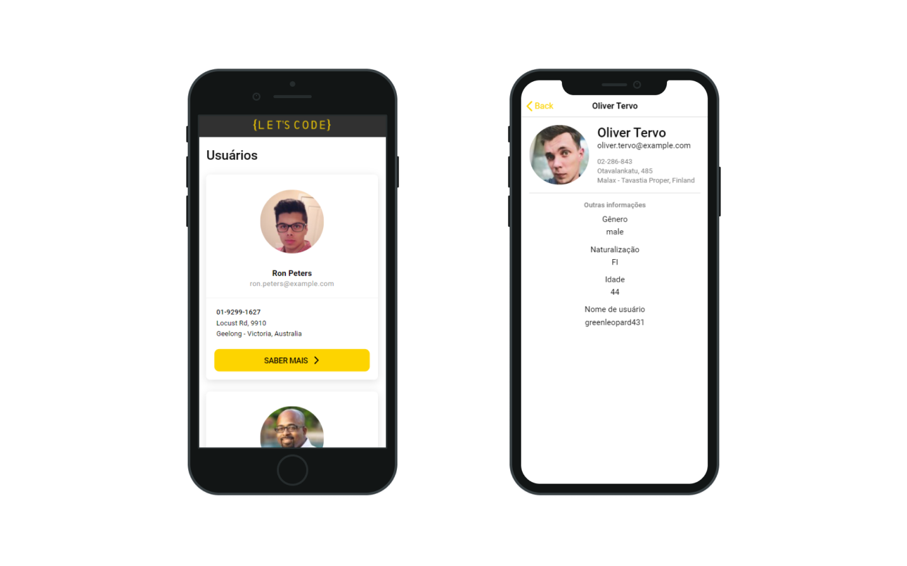

# lets_code-test
Projeto realizado para o teste de Front-End da Let's Code.

  

     
  

  

## Projeto

Para visualizar é preciso clonar o repositório, após isso instalar a cli do ionic com: 
`npm install -g @ionic/cli`

E iniciar com
`ionic serve`
